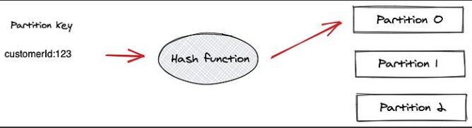

# Partitioning Logic

A producer can use a partition key to direct messages to a specific partition. A partition key can be any value that can be derived from the application context. A unique device ID or a user ID will make a good partition key. If a producer doesn't specify a partition key when producing a record, Kafka will use a round-robin partition assignment.

Messages with the same key are always written to the same partition, and Kafka ensures that consumers receive them in the order they were produced. However, if no partition key is used, the ordering of records can not be guaranteed within a given partition.

